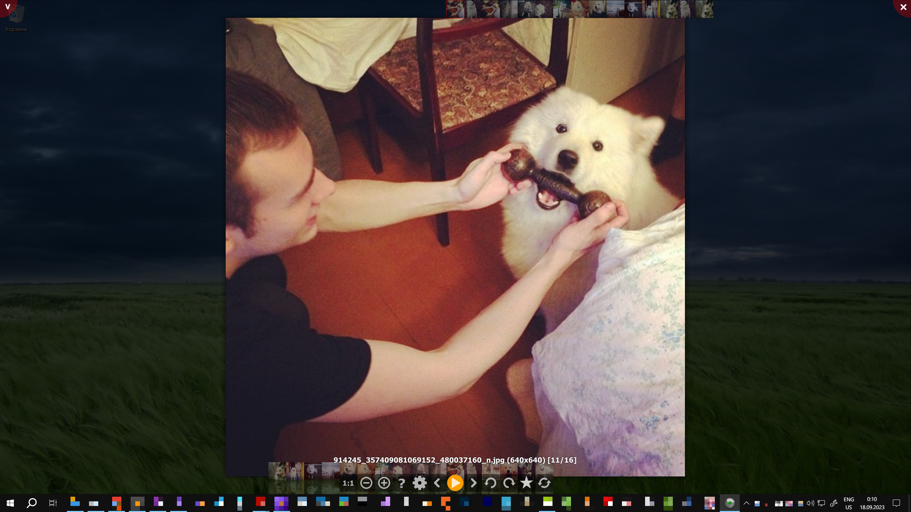
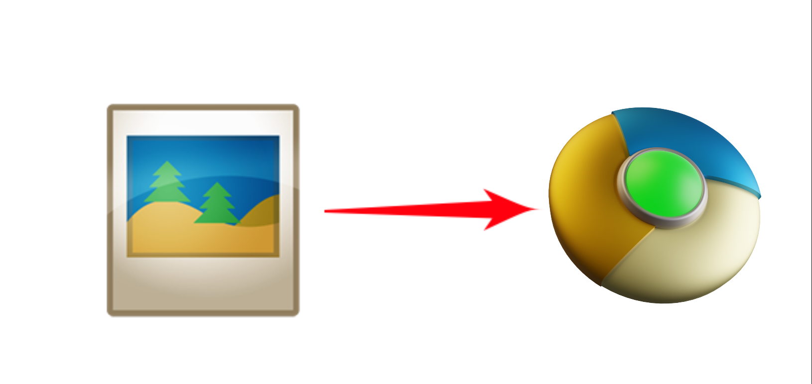
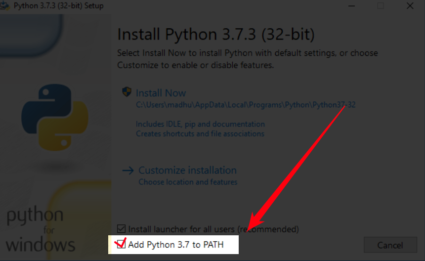

# [Russian] [PyQt] GIF/AnimatedWEBP/WEBP/SVG/PNG/JPG/JPEG/JFIF/ICO/BMP/SVG/TGA/TIF/AVIF/HEIF/HEIC Krumassan Image Viewer v0.90 for Windows by Sergei Krumas

Image Viewer разрабатывается на замену почившей в 2015м году Picasa Photo Viewer. Как и с [моей недавней разработкой Oxxxy Screenshoter](https://github.com/sergkrumas/oxxxy), кое-что взято за основу из оригинала и вдобавок поверх наворочено куча отсебятины. Поверх этого частично будет клонирован и интегрирован функционал программы PureRef (пюре).

# Состояние проекта на сегодня

На данный момент документация ещё не готова и будет готова ближе к релизу летом 2024.

Важно: код не проходил хорошего рефакторинга уже очень давно, следовательно в нём возможны аномалии из говнокода или непонятных наименований, и уже поэтому жалобы по этому поводу не принимаются пока. Всё будет исправлено, когда закончится активная фаза разработки. А пока проще будет воспринимать эту программу как прототип.

- 11 февраля 2022 - начата разработка
- 28 марта 2022 - начато активное использование
- 30 мая 2022 - готова полноценная альфа-версия
- 1 июня 2022 - начаты бета-тесты и допиливания до релизной версии
- с декабря 2022 по апрель 2023 - 1й этап допиливания
- с мая 2023 по 28 сентября 2023 - 2й этап допиливания: внедрение альфа-версий дополнительных фич
- 28 сентября 2023 - 3й этап допиливания: начато клонирование PureRef (пюре) в модуле boards.py

## [Changelog](CHANGELOG.md)

## Лицензия

Весь исходный код выпущен под GNU GPL Version 2

## Иконка приложения
Идея для иконки позаимствована от иконки браузера Chromium, а цвета для неё взяты из иконки самой Picasa Photo Viewer.

## Языки интерфейса

- пока только Русский, летом 2024го планируется добавить Английский, Французский, Немецкий, Итальянский и Испанский языки

## Требования

- Операционная система: Windows 8.1 или Windows 10. В Windows 11 и Linux не тестировалось, хотя теоретически должно работать
- Уметь самостоятельно установить Python нужной версии и работать с командной строкой для установки зависимостей через поставляемую с Python утилиту **pip**
- Версия Python 3.10.6 и выше.
- Установка всех зависимостей через утилиту **pip**, прописанных в файле **install_dependencies.bat**

## Поддерживаемые форматы файлов
- .webp (анимированные и статические)
- .gif
- .jpg/.jpeg
- .jfif
- .png
- .tif/.tiff
- .tga
- .svg/.svgz
- .ico
- .bmp
- .avif/.heif/.heic

Подробности можно узнать в коде статического метода `is_interest_file`.

## Установка, запуск, краткое описание возможностей и что делать, когда приложуха падает

### Установка

Сперва надо скачать Python [отсюда](https://www.python.org/downloads/) и затем установить. 

ВАЖНО: В процессе установки нужно обязательно прожать галочку около пункта "Add Python X.XX to PATH", иначе проблемы с установкой зависимостей придётся решать самостоятельно и вручную. Если вы пропустили эту галочку, то просто удалите Python и установите заново держа в памяти, что нужно установить галочку напротив "Add Python X.XX to PATH".

После установки Python нужно установить все зависимости запустив файл **install_dependencies.bat** двойным кликом. Появится консольное окно в котором будет отображаться ход процесса. После окончанчания процесса окно закрокется и Image Viewer будет готов для запуска.

### Как запустить приложение

Если Python и зависимости были установлены, то двойной клик по файлу `viewer.pyw` запустит программу. Кликом в окне программы или перетаскиванием папки или изображения на окно можно начать просматривать изображения.

### Регистрация VIEWER.PYW в качестве Windows-приложения

Чтобы **VIEWER.PYW** определился в Windows как приложение, нужно занести некоторые настройки в реестр Windows.

Что нужно сделать:
- 1) Если не нравится иконки по умолчанию, то самое время будет их заменить. Если же вам нравятся эти иконки, то просто пропустите этот шаг. При замене иконок строго соблюдайте сохранение исходных имён ico-файлов, иначе программа их не найдёт. Для примера вы можете взять каноническую иконку из Picasa Photo Viewer, как это сделал я у себя на компьютере. Я я бы с радостью мог включить иконку Picasa Photo Viewer в мой опенсорсный клон, но исходя из условий лицензии GNU GPL, я этого делать не имею права. Иконка `image_viewer.ico` отвечает за иконку файлов изображений, которые будут ассоциированы с этим приложением, а иконка `image_viewer_lite.ico` отвечает за иконку самого приложения на Панели задач Windows.
- 2) В папке приложения двойным кликом нужно запустить файл `get_winreg_file.pyw`, в результате выскочит сообщение, где будет написано, что в папке с программой теперь лежит reg-файл. 
- 3) Далее его нужно запустить двойным кликом и Windows затребует подтверждения внедрения в реестр (возможно для этого потребуются права администратора). 

После этих несложных действий программу можно будет увидеть в контестном меню Проводника Windows для файлов-изображений в пункте меню "Открыть с помощью...", а в распахнувшемся подменю программа будет называться **Krumassan Image Viewer**. Вдобавок теперь будет возможно вручную выбрать Image Viewer как программу для просмотра по умолчанию в свойствах файлов изображений. К сожалению, нет способа автоматически задать Image Viewer приложением по умолчанию для просмотра всех типов изображений из-за предпринятых в Windows мер безопасности. К счастью, в папке **test** этого репозитория собраны все распространённые типы изображений, так что не придётся искать файлы всех типов у себя на компе, чтобы задать им для просмотра эту программу по умолчанию.

### Короткое описание возможностей

- Мой опенсорсный клон практически полностью копирует просмоторщик изображений Picasa Image Viewer, но без утилиты для библиотеки и загразки изображений в Интернет
- Клавиша F1 даёт понять какие клавиши зайдествованы в управлении (пока только на Русском, так что те, кто не знают Русский используйте переводчики в телефонах)
- Есть история просмотра папок
- Есть история просмотра текущей папки для текущей сессии
- Изображения, даже самые маленькие, стремятся заполнить всё пространство монитора
- Есть иконка в трее
- Во вьюпорте можно смотреть метадату изображения, если включена соответствующая настройка
- Любая область картинки может быть прокомментирована текстовым блоком
- Доступна библиотека ранее открытых папок (не доступно в лайтовом режиме)
- Каждое изображение может быть протегано
- Миниатюрки изображений можно менять местами
- клон PUREREF на одной из страниц приложения для создания интерактивных коллажей/досок

Программа доступна в лайтовом (упрощённом) режиме и в обычном.

И это далеко не всё! Когда будет готов релиз, на Youtube будет загружено видео рассказывающая о всех фичах моего клона, некоторые из этих фич добавлены просто для фана.

### Запуск из консоли

`python.exe viewer.pyw path_fo_folder_or_image_file`

- `-lite` - затребовать запуск в упрощённом режиме
- `-full` - затребовать запуск в обычном (полном) режиме
- `-frame` - затребовать запуск в окне, а не показывать окно на полный экран
- `-forcelibrarypage` - затребовать запуск со страницы библиотеки

- `-rerun` - (служебное, не для использования напрямую), для моментального перезапуска процессов, стартовавших из проводника Windows
- `-aftercrash` - (служебное, не для использования напрямую), для показа сообщений об необработанных ошибках, возникших во время работы программы

### Когда приложуха упала

Бывают случаи, когда из-за фатальной ошибки программа тихо падает или иначе говоря крашится, то есть у пользоватля пропадает её окно из виду. В таком случе информация о краше автоматически будет записана в специальный файл `crash.log`, который обычно находится в папке приложения. Содержимое этого файла как раз и нужно присылать в раздел Issues.
Сразу после краша на экране должен появиться маленький диалог, который предложит по желанию перезапустить приложение заново или отказаться от перезапуска.

Если программа не запускается при даблклике на файле `viewer.pyw` или при даблклике на изображении, то имеет смысл проверить содержимое файла `crash.log` в папке приложения и отправить его содержимое разработчику в раздел Issues на GitHub.

## Важно (для энтузиастов и программистов)

Из-за GIL в Си-шной реализации Python потоки QThread не работают так, как теоретически задумано, т.е. они выполняются по очереди, а не параллельно. Код обработки данных, например код создания превьюшек, с какого-то момента стал писаться исходя из того, что потоки выполняются по очереди, поэтому имейте ввиду, что при запуске в реальном многопоточном режиме могут появиться сбои, зависания и баги.

## Дальнейшие планы

- Повысить производительность приложения обойдя питоновский GIL
- Сделать переводы интерфейса на Английский, Французский, Немецкий, Итальянский и Испанский
- Для страницы Board добавить возможность оставлять пометки с помощью модуля Oxxxy, сохранять их на диск, и при надобности отображать их при повторном открытии
- Отрефакторить весь код
- Сделать релиз и написать подробную документацию
- Автоматическая ассоциация с файлами изображений через реестр Windows

## [Ручное тестирование и рефакторинг](MANUAL_TESTING.md)
