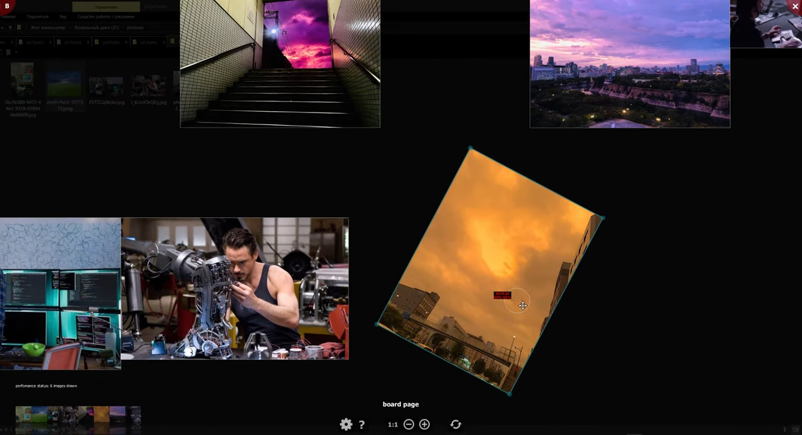
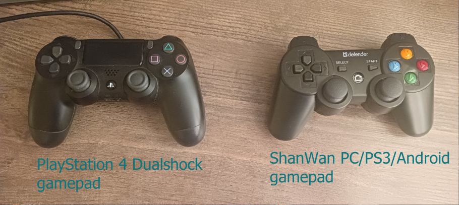

# [PyQt] GIF/AnimatedWEBP/WEBP/APNG/PNG/JPG/JPEG/JFIF/ICO/BMP/SVG/TGA/TIF/AVIF/HEIF/HEIC Krumassan Image Viewer v0.90 Alpha for Windows by Sergei Krumas

Krumassan Image Viewer is being developed to replace Google Picasa Photo Viewer, which on February 2016 Google announced it was discontinuing support for.

In addition, the program has some PureRef features if you switch to BOARD page (top left corner menu).

~~The first release is planned for the summer 2025, so there's no full user guide at the moment~~

**(sergkrumas, 30 August 2025): with the translating project (to German, French, Spanish and Italian) falling behind schedule and Qt5 losts support in May of 2025 (but PyQt5 is still available), this postponed the first release to the summer 2026.**

**Feel free to test the viewer, report issues and use it further! Thank you for your attention!**

## [Гайд для русскоязычных / in Russian](README_ru.md)

## Start page

Start page shows up when the app is run directly i.e. without request from Windows Explorer. You can select UI language at the bottom. The picture on the background is desktop wallpaper.

## Viewer page (Google Picasa Photo Viewer Clone)

Viewer Page Presentation on Youtube:

### Viewing animated images (GIFs, Animated PNGs)
- Spacebar key - pauses/resumes playback
- Rolling the mouse wheel while holding left mouse button - changes current animation frame
- Rolling the mouse wheel while holding Shift **and** Ctrl key - changes playback speed (from 10% to 200%)
- «Save .png/.jpg file...» in Context menu - saves current animation frame to .png/.jpg file 

## Board page (PureRef Clone)

Board Page Presentation on Youtube:

You can navigate via Playstation 4 DualShock gamepad or ShanWan PC/PS3/Android gamepad.

## Supported formats
- .webp (static & animated)
- .gif
- .jpg/.jpeg
- .jfif
- .png/.apng
- .tif/.tiff
- .tga
- .svg/.svgz
- .ico
- .bmp
- .avif/.heif/.heic

## UI Languages
- English & Russian
- ***French, German, Italian & Spanish in process***

## Requirements
- Operation System: Windows 8.1/10. We don't know anything about Windows 11, you can try out yourself
- Python 3.10.6 or higher, 64-bit
- Install Python of the required version on your own using the guide below
- Install all Python-dependencies on your own by executing **install_dependencies.bat**

## Installation

First things first, you need to download 64-bit version of Python [from here](https://www.python.org/downloads/) and intall it.

IMPORTANT: As installation wizard showed up, you need to activate checkbox "Add Python 3.XX to PATH", otherwise there will be problems with dependencies installation and it'll take you knowledge and command line skills to tackle and cope with that on your own.

After Python installation success, you need to install all dependencies by double-cliking on **install_dependencies.bat** in Windows Explorer. Once you double-click on file, console window shoes up and you could watch the ongoing progress. As all dependencies downloaded and installed, console window automatically closes and it means that Krumassan Image Viewer is ready to run.

### Registration of VIEWER.PYW as application for Windows Explorer

We need to touch windows registry in order to achieve integration with Windows Explorer.

Follow these steps:
- 1) If you don't like default icons, it's high time to replace it, otherwise just skip that step. When replacing icons with your own ones strictly preserve original .ico-files  names otherwise application couldn't find these. You can extract the canonical Picasa Photo Viewer icon as I did on my computer. I would love to include a Picasa Photo Viewer icon in that open source clone, but I'm not allowed to do so under the terms of the GNU GPL license. The Icon with filename `image_viewer.ico` shows up for every image file in Windows Explorer that has been associated with application, the other icon with filename `image_viewer_lite.ico` shows up on windows taskbar as app icon
- 2) Go to the app folder, then double-click on the file `get_winreg_file.pyw`. As a result the message box shows up informing that reg-file generated and placed to the app folder. Double-click on generated reg-file and then confirm registry operation (this may require to run as administrator to be succeced)

After these steps you could see the app in Windows Explorer context menu for images files: in the menu item "Open with...", and in the opened submenu the program will be called **Krumassan Image Viewer**. From now on you can manually associate the app with images files. Unfortunatly, there's no way to automatically set all these associations due to the Windows security measures taken. Fortunatly, in this repository, in folder **test** you can find all files with common image extensions to set associations manually. 

## How to use

If you've installed Python and dependencies, then double-click on `viewer.pyw` runs the program. You can start watching images by left click or by dropping folder or image inside viewer window. Or just click on any assocciated file in Windows Explorer if you registered VIEWER.PYW as windows application as shown above.

## How to run from console

`python.exe viewer.pyw path_fo_folder_or_image_file`

Make sure that python.exe has suited version. See requirements about Python version above. 

## Features 
- complete clone if we talk about the image viewer itself 
- F1 key to see which key doing what
- Viewing history per folder and per global one 
- Small images tend to fit maximum screen area (this behavior could be finely tuned in the app settings)
- Changing images order by rearranging image thumbnails
- Observing interactive collages on Board Page (PureRef Clone) 
- Plugin system for Board Page

Program runs in lite mode by default, but standard mode is available.

When running in standard mode:
  - Tray icon
  - Image metadata viewer  
  - Commented image regions
  - Viewed folders history in library page, stored to disk 
  - Tags for images

## What to do on app crash
There are cases, when the program behaves unexpectedly and crashes. Once the situation occured, program will try to write all information about incident to the file `crash.log`, which is located in the app folder by default. The content of that file is main part of any bug report goes to the Issues section of that project.

Once the program won't start after double-clicking on file `viewer.pyw` or after double clicking on image in Explorer, then it will be wise to check the content of the file `crash.log` in the app folder. Without embarrassment send that crash information to be analyzed by developer to Issues section https://github.com/sergkrumas/image_viewer/issues.

You get this app for free, so you could help to improve it that way or participate in manual testing. Thank you in advance.

