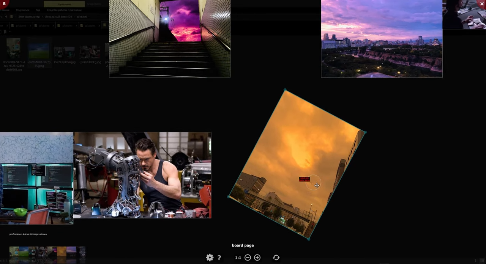
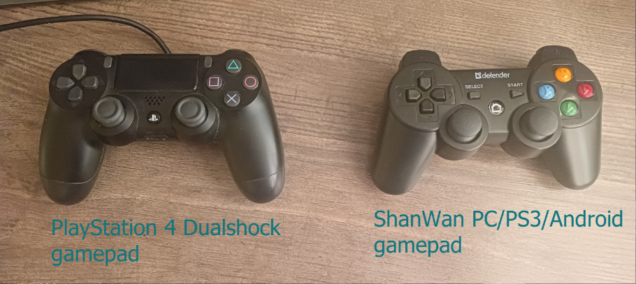
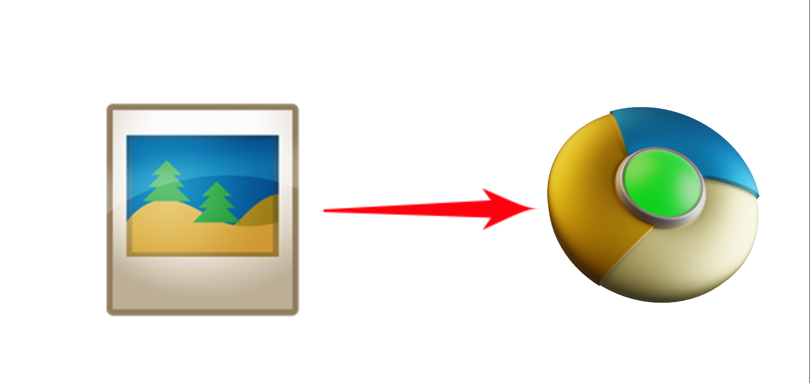

# [Russian] [PyQt] Krumassan Image Viewer v0.90 для Windows от Сергея Крумаса

Krumassan Image Viewer разрабатывается на замену почившей в 2015м году программе Picasa Photo Viewer. 

Как и с [моей недавней разработкой Oxxxy Screenshoter](https://github.com/sergkrumas/oxxxy), кое-что взято за основу из оригинала и поверх наворочено куча отсебятины. 

Дополнительно клонируются части функционала программы PureRef (в простонародье «пюре») и тоже преображаются отсебятиной.

## Угловое меню страниц
Приложение построено на основе концепта страниц. Каждая страница предоставит вам отличный от других страниц опыт любования картинками.

Поменять текущую страницу можно в меню левого верхнего угла или нажимая клавишу `TAB`.

Если не нравится красный цвет уголков и меню, то в настройках этого самого приложения его всегда можно обесцветить до градации серого практически сливающимся с фоном приложения.

## Стартовая страница
Стартовая страница отображается, когда приложение запускали напрямую, то есть, без запроса из проводника Windows. Внизу кликая по флагам можно выбрать язык. Картинка на фоне это фон рабочего стола.

## Страница вьювера (Viewer Page, тот самыый клон Google Picasa Photo Viewer)
Открывается по умолчанию. Программа стартует с этой страницы, если в настройках программы не указана другая страница.

Презентация страницы вьювера на ютубе:

### Просмотр анимированных картинок (гифок, APNG-файлов)
- клавиша Пробел - останавливает/возобновляет воспроизведение
- прокручивание колеса мыши с зажатой левой кнопкой мыши - ручное прокручивание анимации вперёд и назад
- прокручивание колеса мыши с зажатыми одновременно клавишами Shift и Ctrl - смена скорости проигрывания (в пределах от 10% до 200% от нормальной скорости)
- «Сохранить .png/.jpg файл...» в контекстном меню - сохраняет текущий кадр в файл .png/.jpg  

### Лупа для заданного прямоугольного выделения 
Зажмите клавишу `Ctrl` и с нажатой левой кнопкой мыши задайте прямоугольную область изображения, которую хотели бы посмотреть в максимально возможном увеличении, которое позволяют размеры окна. Для выхода из режима увеличения нажмите клавишу `Esc`.
Если в настройках приложения включены анимационные эффекты, то будет проиграна анимация зума.

## Страница открытых папок (Library Page)

Эта страница появилась только из-за моего сильного раздражения при использовании оригинального Picasa Photo Viewer. А именно - при запросе открытия файла из другой папки проводника Windows, отображение изображений текущей папки прекращалось, и нельзя было переключиться на неё обратно. По идее, Library Page надо заменять на плашку вкладок, как это сделано в веб-браузерах и современном проводнике в Windows 11. Однако, плашка вкладок будет плохо визуально сочетаться со стилем всего приложения, поэтому я пока не тороплюсь что-либо переделывать.

В списке слева отображаются все открытые в данный момент папки. Текущая папка подцвечена тёмно-жёлтым. В правой части отображается контент текущей папки. Кликом по списку слева можно выбирать текущую папку, контент которой будет отображаться на страницах доски (Board page), каскадной сетки (Waterfall page) и вьювера (Viewer page).

Вид страницы открытых папок, когда приложение запущено в упрощённом режиме:

Вид страницы открытых папок, когда приложение запущенно в стандартном режиме или если дополнительно через стартовую страницу было открыто несколько папок:

Превьюшки в правой части больше, чем превьюшки на странице вьювера в панели управления.
При наведении курсора мыши на превьюшку в правой части, в левой части отобразится её оригиинал с максимальном масштабе, однако анимированные файлы не поддерживаются:

## Страница интерактивной доски (Board Page, клон программы PureRef)
Разработка идёт с середины 2023 года, вдохновлена программой PureRef. Сейчас клон потихоньку устремляется к своеобразной оффлайновой альтернативе MIRO. Однако, в отличие от клона Picasa Photo Viewer, эта разработка ведётся полностью в моих интересах. Мне просто легче иметь два клона в одном приложении, чем создавать два отдельных приложения.

Презентация страницы интерактивной доски на ютубе:

В целях навигации по доске можно пользоваться геймпадом Playstation 4 DualShock или его дешёвым аналогом - ShanWan PC/PS3/Android. Читайте справку F1 для того, чтобы активировать управление с геймпада в программе.

Если геймпада в семье нет (или у вас какой-нибудь геймпад от Xbox, которые не поддерживаются в данный момент), то облегчить его отсутствие можно через встроенный автоскролл, который активируется и дезактивируется через нажатие на колесо мыши. Автоскролл работает так же, как он работает в большинстве веб-браузеров. Ну и чтобы окончательно было хорошо, в режиме автоскролла масштабирование становится плавней, добавляется затухание.

### Плагины интерактивной доски (доступны через подменю контекстного меню)
Каждый плагин предлагает свою доску со своей атмосферой и элементами на ней. Всё это совсем не документировано, но для меня разработка имеет огромный потенциал.

#### Визуализатор цепочек касательных к окружностям (пример плагина интерактивной доски - Tangents Chain)
На скриншоте ниже всё расписано, повторяться тут не буду (Сгенерированная Рапунцель на фоне это фон рабочего стола, а не фича плагина): 

## Страница каскадной сетки превьюшек (Waterfall page)

Если нравится ползать по Pinterest, то понравится и эта страница, где очень легко потеряться в многочисленных столбцах.
Идея этой страницы возникла из-за того, что на странице открытых папок (Library Page) эти столбцы превьюшек занимают лишь половину ширины, а при наведении на превьюшки не проигрываются анимационные файлы.

Левый клик по превьюшке открывает модальный вьювер, который точь-в-точь такой же как на странице вьювера (Viewer Page).

Чтобы изменить количество столбцов, надо крутить колесо с зажатым `Ctrl`. Количество столбцов сохраняется в настройках. Если выбрано 0 столбцов, то их будет столько, сколько в данный момент может уместиться в ширину окна приложения. Если их выбрано больше, чем может уместиться, то будет отображаться столько, сколько умещается.

Чтобы изменить расстояние между изображениями по вертикали и по горизонтали, зажмите `Ctrl` и `Shift` и крутите колесо мыши.

Приложение может открываться на этой странице, если в настройках выставлено соотвествтующее пожелание.

В общем и целом, в модальном вьювере клавиатура и мышь работают так же, как и на странице вьювера. Также доступна лупа для заданного прямоугольного выделения, такая же как и на странице вьювера. 

## Состояние проекта на сегодня

**(30 авг 25) Из-за неготового перевода на французский, немецкий, итальянский и испанский языки и того, что Qt5 (Qt5 составляет основу PyQt5, на основе которого написана эта программа) перестали поддерживать, релиз программы переносится на лето 2026 года.**

**Продолжайте тестировать, уведомлять о багах и пользоваться программой дальше! Спасибо за внимание к этому вопросу!**

На данный момент релиза не было, а значит документация ещё не готова и пролить свет на процесс разработки может только [CHANGELOG.md](CHANGELOG.md) и самостоятельное чтение исходников.

Важно: код рефакторится только частично при внедрерии фичи, которая требует рефаткоринга, а вообще, код не проходил тотального рефакторинга уже очень давно, следовательно в нём возможны аномалии из говнокода или неясных наименований, и уже поэтому жалобы по этому поводу не принимаются пока. Всё будет исправлено после окончания активной фазы разработки. А пока проще будет воспринимать эту программу как прототип.

## [Changelog и дальнейшие планы](CHANGELOG.md)

В общем и целом, после релиза разработка будет продолжаться в направлении интерактивной доски (Board Page), с вьювером более-мене уже всё сделано.

### Историческая справка вместе с планами на будущее

| Дата | Viewer Page (Google Picasa Photo Viewer Clone), Waterfall Page | Boards Page (PureRef Clone) |
|------|--------------|------------------|
| 11 фев 2022 | Начало разработки | |
| 28 мар 2022 | Начинаем пользоваться сырой альфа-версией под Windows | |
| 30 мая 2022 | Готова бета-версия | |
| 1 июн 2022 | Начаты бета-тесты и подготовка к релизу | |
| дек 2022 - апр 2023 | 1й этап подготовки к релизу | |
| май 2023 - сент 2023 | 2й этап подготовки к релизу и перенос даты релиза | |
| 28 сент 2023 - 21 окт 2023 | | Начато клонирование PureRef (пюре) |
| 31 окт 2023 - 27 мая 2024 | | Начата разработка интеграции с OXXXY |
| 27 мая 2024 - **(пока не завершено)** | | Доработка недостающих частей функционального ядра |
| окт 2024 | доведение UX до ума и исправление крашей | |
| 5 ноя 2024 | синхронизация порядка миниатюрок с порядком файлов в папке Windows | |
| 1 дек 2024 | перевод UI на английский язык (русский остаётся как опция в настройках) | перевод UI на английский язык (русский остаётся как опция в настройках) |
| 2025 | UX-усовершенствования, правка багов, рефакторинг  | правка багов, рефакторинг, поддержка геймпадов для навигации |
| янв 2026 | Внедрение Waterfall Page, вертикального автоскролла для списков, подготовка к переводу на иностранные языки | автоскролл во все стороны для навигации по доске |
| ***ВЫ НАХОДИТЕСЬ ЗДЕСЬ*** 
| ???? | **многопоточная генерация миниатюрок** | **многопоточная генерация превьюшек, многопоточная подгрузка контента** |
| ???? | **подробная документация и ролик на Youtube** | |
| ???? | **Удобный инсталлятор для Windows** | |
| ???? | **первый релиз** | |
| ???? | **поддержка DirectX для страницы вьювера** | |
| ???? | **поддержка PSD-файлов** | |
| ???? | | **для айтемов - история создания, перемещения, вращения, масштабирования и прочих операций редактирования** |
| ???? | | **для айтемов - поддержка аудио и видео** |
| ???? | | **для айтемов на досках - интерактивный таймлайн** |
| ???? | | **монтажный стол** |
| ???? | | **завершение интеграции с OXXXY** |
| после 2026 | **второй релиз** | |

## Лицензия

Весь исходный код выпущен под GNU GPL Version 3

## Иконка приложения
Идея для иконки позаимствована от иконки браузера Chromium, а цвета для неё взяты из иконки самой Picasa Photo Viewer.

## Языки интерфейса
- Русский и Английский
- работа над Францзуским, Немецким, Итальянским и Испанским в процессе

## Требования

- Операционная система: Windows 8.1/10. В Windows 11 и Linux не тестировалось, хотя теоретически должно заработать без проблем
- Версия Python 3.10.6 и выше.
- Самостоятельно установить Python требуемой версии по гайду внизу
- Самостоятельно установить все зависимости посредством запуска файла **install_dependencies.bat**

## Поддерживаемые форматы файлов
- .webp (анимированные и статические)
- .gif
- .jpg/.jpeg
- .jfif
- .png/.apng
- .tif/.tiff
- .tga
- .svg/.svgz
- .ico
- .bmp
- .avif/.heif/.heic

Подробности можно узнать в коде статического метода `is_interest_file`.

## Установка, запуск, краткое описание возможностей и что делать, когда приложуха падает

### Установка

Сперва надо скачать Python [отсюда](https://www.python.org/downloads/) и затем установить.

ВАЖНО: В процессе установки нужно обязательно прожать галочку около пункта "Add Python X.XX to PATH", иначе проблемы с установкой зависимостей придётся решать самостоятельно и вручную. Если вы пропустили эту галочку, то просто удалите Python и установите заново держа в памяти, что нужно установить галочку напротив "Add Python X.XX to PATH".

После установки Python нужно установить все зависимости запустив файл **install_dependencies.bat** двойным кликом. Появится консольное окно в котором будет отображаться ход процесса. После окончанчания процесса окно закрокется и Image Viewer будет готов для запуска.

### Как запустить приложение

Если Python и зависимости были установлены, то двойной клик по файлу `viewer.pyw` запустит программу. Кликом в окне программы или перетаскиванием папки или изображения на окно можно начать просматривать изображения.

### Регистрация VIEWER.PYW в качестве Windows-приложения

Чтобы **VIEWER.PYW** определился в Windows как приложение, нужно занести некоторые настройки в реестр Windows.

Что нужно сделать:
- 1) Если не нравится иконки по умолчанию, то самое время будет их заменить. Если же вам нравятся эти иконки, то просто пропустите этот шаг. При замене иконок строго соблюдайте сохранение исходных имён ico-файлов, иначе программа их не найдёт. Для примера вы можете взять каноническую иконку из Picasa Photo Viewer, как это сделал я у себя на компьютере. Я я бы с радостью мог включить иконку Picasa Photo Viewer в мой опенсорсный клон, но исходя из условий лицензии GNU GPL, я этого делать не имею права. Иконка `image_viewer.ico` отвечает за иконку файлов изображений, которые будут ассоциированы с этим приложением, а иконка `image_viewer_lite.ico` отвечает за иконку самого приложения на Панели задач Windows.
- 2) В папке приложения двойным кликом нужно запустить файл `get_winreg_file.pyw`, в результате выскочит сообщение, где будет написано, что в папке с программой теперь лежит reg-файл.
- 3) Далее его нужно запустить двойным кликом и Windows затребует подтверждения внедрения в реестр (возможно для этого потребуются права администратора).

После этих несложных действий программу можно будет увидеть в контестном меню Проводника Windows для файлов-изображений в пункте меню "Открыть с помощью...", а в распахнувшемся подменю программа будет называться **Krumassan Image Viewer**. Вдобавок теперь будет возможно вручную выбрать Image Viewer как программу для просмотра по умолчанию в свойствах файлов изображений. К сожалению, нет способа автоматически задать Image Viewer приложением по умолчанию для просмотра всех типов изображений из-за предпринятых в Windows мер безопасности. К счастью, в папке **test** этого репозитория собраны все распространённые типы изображений, так что не придётся искать файлы всех типов у себя на компе, чтобы задать им для просмотра эту программу по умолчанию.

### Короткое описание возможностей

- Мой опенсорсный клон практически полностью копирует просмоторщик изображений Picasa Image Viewer, но без утилиты для библиотеки изображений и их загрузки в Интернет
- Клавиша F1 даёт понять какие клавиши зайдествованы в управлении (пока только на Русском, так что те, кто не знают Русский используйте переводчики в телефонах)
- Есть история просмотра папок
- Есть история просмотра текущей папки для текущей сессии
- Изображения, даже самые маленькие, стремятся заполнить всё пространство монитора
- Есть иконка в трее
- Во вьюпорте можно смотреть метадату изображения, если включена соответствующая настройка
- Любая область картинки может быть прокомментирована текстовым блоком
- Доступна библиотека ранее открытых папок (не доступно в лайтовом режиме)
- Каждое изображение может быть протегано
- Миниатюрки изображений можно менять местами, тем самым можно менять порядок изображений для просмотра
- на странице Board клон PUREREF для создания интерактивных коллажей/досок из изображений

Программа доступна в лайтовом (упрощённом) режиме и в обычном.

И это далеко не всё! Когда будет готов релиз, на Youtube будет загружено видео рассказывающая о всех фичах моего клона, некоторые из этих фич добавлены просто для фана.

### Запуск из консоли

`python.exe viewer.pyw path_fo_folder_or_image_file`

- `-lite` - затребовать запуск в упрощённом режиме
- `-full` - затребовать запуск в обычном (полном) режиме
- `-frame` - затребовать запуск в окне, а не показывать окно на полный экран
- `-forcelibrarypage` - затребовать запуск со страницы библиотеки

- `-rerun` - (служебное, не для использования напрямую), для моментального перезапуска процессов, стартовавших из проводника Windows
- `-aftercrash` - (служебное, не для использования напрямую), для показа сообщений об необработанных ошибках, возникших во время работы программы

### Если приложуха упала

Бывают случаи, когда из-за фатальной ошибки программа тихо падает или иначе говоря крашится, то есть у пользоватля пропадает её окно из виду. В таком случе информация о краше автоматически будет записана в специальный файл `crash.log`, который обычно находится в папке приложения. Содержимое этого файла как раз и нужно присылать в раздел Issues.
Сразу после краша на экране должен появиться маленький диалог, который предложит по желанию перезапустить приложение заново или отказаться от перезапуска.

Если программа не запускается при даблклике на файле `viewer.pyw` или при даблклике на изображении, то имеет смысл проверить содержимое файла `crash.log` в папке приложения и отправить его содержимое разработчику в раздел Issues на GitHub https://github.com/sergkrumas/image_viewer/issues.

## [Описание архитектуры приложения](ARCHITECTURE.md)
## [Ручное тестирование и рефакторинг](MANUAL_TESTING.md)
